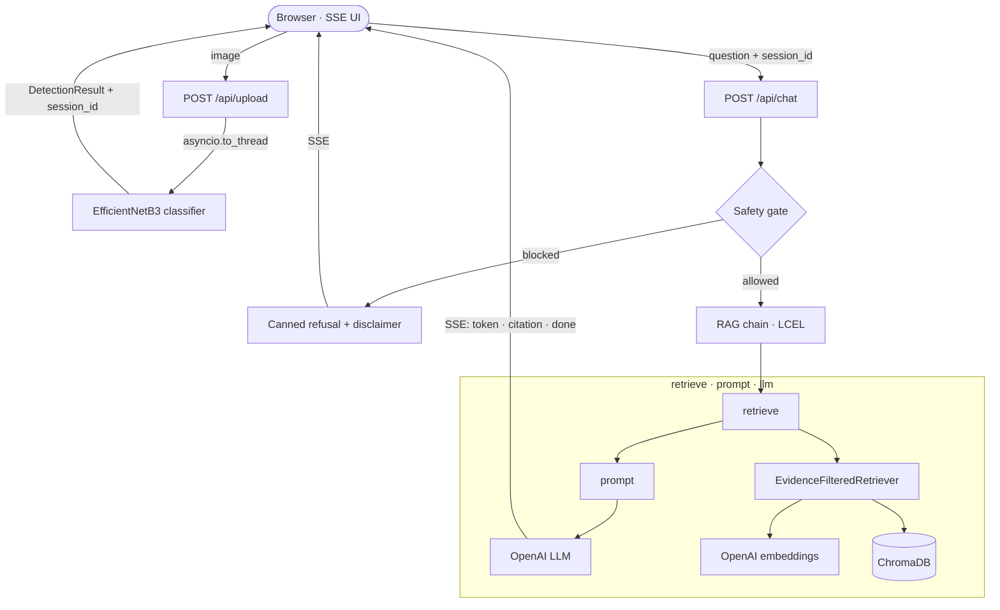

<div align="center">

# Integration of VLM and Deep Learning models for Skin Cancer Classification in Chatbot App

**AI-assisted skin-cancer education, grounded in real sources.**

Combines **EfficientNetB3** cancer classification with a **RAG-grounded, bilingual
(🇮🇩 / 🇬🇧) chatbot** that answers from a curated medical knowledge base, with inline
citations and a mandatory medical disclaimer on every turn.


</div>

> [!WARNING]
> This is an **educational tool, not a diagnostic device.** It never provides a definitive
> diagnosis. Always consult a qualified dermatologist for diagnosis and treatment.

---

## Table of Contents

- [Features](#features)
- [How it works](#how-it-works)
- [Tech stack](#tech-stack)
- [Getting started](#getting-started)
- [Configuration](#configuration)
- [API reference](#api-reference)
- [Project structure](#project-structure)
- [Testing](#testing)
- [Roadmap](#roadmap)
- [License](#license)

---

## Features

- **Related skin conditions classification** — Use VLM to classify the image of related skin conditions.
- **Cancer classification** — EfficientNetB3 across 4 classes (Melanoma, Basal Cell
  Carcinoma, Squamous Cell Carcinoma, Nevus).
- **Bilingual RAG chatbot** — Indonesian + English, grounded in patient-education
  guidelines (AAD, MedlinePlus, DermNet) and curated PubMed abstracts.
- **Verifiable citations** — every answer is filtered to the sources it actually cited.
- **Safety-first by design** — mandatory disclaimer on *every* turn, canned refusals for
  unsafe-dosage / off-topic queries, and prompt-injection-resistant detection handling.
- **Swappable backends** — OpenAI / Ollama / vLLM / Pinecone behind `Protocol` +
  factory, selected via env var.

## How it works



The RAG chain is a pure LCEL pipeline `retrieve | prompt | llm`. Retrieved chunks below the
similarity threshold are dropped (failing closed), the answer streams token-by-token, and
citations are emitted **after** generation — filtered to the `[n]` markers the answer used.
See [`docs/architecture.md`](docs/architecture.md) for the full module map.

## Tech stack

| Layer | Choice |
|-------|--------|
| Web framework | FastAPI + Uvicorn (SSE streaming) |
| LLM / orchestration | OpenAI (`gpt-4o-mini`) via LangChain (LCEL, `astream_events`) |
| Embeddings | OpenAI `text-embedding-3-small` |
| Vector store | ChromaDB (local, persistent) |
| Image model | EfficientNetB3 (TensorFlow/Keras `.h5`) |
| UI | Server-rendered Jinja2 + vanilla JS `EventSource` |
| Language | Python 3.11 |

## Getting started

### Prerequisites

- **Python 3.11** (`>=3.11,<3.12`)
- An **OpenAI API key**
- The trained model file `skinCancer.h5` (~134 MB) — see [`model/README.md`](model/README.md)

### Installation

```bash
git clone https://github.com/Myrythm/Integration-of-GPT-4o-Vision-and-EfficientNetB3-for-Skin-Cancer-Classification-in-Chatbot-App.git
cd Integration-of-GPT-4o-Vision-and-EfficientNetB3-for-Skin-Cancer-Classification-in-Chatbot-App

python -m venv .venv
source .venv/bin/activate        # Windows: .venv\Scripts\activate
pip install -r requirements.txt

cp .env.example .env             # then edit .env and set OPENAI_API_KEY
```

Place the model file at `./model/skinCancer.h5` (or point `MODEL_PATH` elsewhere).

### Ingest the knowledge base

The chatbot needs a populated vector store before it can answer end-to-end:

```bash
python -m services.rag.ingestion --source all --rebuild   # AAD + MedlinePlus + DermNet
python -m services.rag.ingestion --source pubmed          # PubMed (ingested separately)
```

### Run

```bash
python -m uvicorn main:app --reload
```

Open **http://localhost:8000** — or hit the API directly (see below).

## Configuration

All settings load from `.env` via `pydantic-settings` (see [`.env.example`](.env.example)):

| Variable                       | Default                  | Description                                             |
| --------------------------------| --------------------------| ---------------------------------------------------------|
| `OPENAI_API_KEY`               | —                        | **Required.** OpenAI key (startup fails if empty).      |
| `LLM_BACKEND`                  | `openai`                 | LLM backend (`openai`; `ollama`/`vllm` are stubs).      |
| `OPENAI_MODEL`                 | `gpt-4o-mini`            | Chat model.                                             |
| `OPENAI_EMBEDDING_MODEL`       | `text-embedding-3-small` | Embedding model.                                        |
| `OPENAI_VISION_MODEL`          | `gpt-4o`                 | Vision model that validates an upload is a skin lesion. |
| `VECTOR_STORE_BACKEND`         | `chroma`                 | Vector store (`chroma`; `pinecone` is a stub).          |
| `CHROMA_PATH`                  | `./data/chroma_db`       | Chroma persistence path.                                |
| `RAG_SIMILARITY_THRESHOLD`     | `0.3`                    | Min. score to keep a retrieved chunk.                   |
| `RAG_TOP_K` / `RAG_RETRIEVE_K` | `5` / `10`               | Chunks used / fetched per query.                        |
| `MODEL_PATH`                   | `./model/skinCancer.h5`  | EfficientNetB3 weights.                                 |

> Advanced tunables (memory TTL/size, LLM temperature, stream timeout, batch sizes) also live
> in `config.py` and are overridable via matching env vars.

## API reference

| Method | Endpoint | Description |
|--------|----------|-------------|
| `POST` | `/api/upload` | Classify a lesion image → `DetectionResult` + `chat_session_id`. |
| `POST` | `/api/chat` | Ask a question → **Server-Sent Events** stream. |
| `GET` | `/health` | Liveness probe. |
| `GET` | `/ready` | Readiness probe (503 until app state is initialized). |
| `GET` | `/` · `/upload` · `/chat` | Server-rendered UI pages. |

**1. Classify an image**

```bash
curl -F "file=@lesion.jpg" http://localhost:8000/api/upload
# → {"detection": {"label": "Melanoma", "confidence": 0.87, ...},
#    "chat_session_id": "11111111-1111-4111-8111-111111111111"}
```

**2. Chat about it** (stream tokens; `session_id` must be the UUID from step 1)

```bash
curl -N -X POST http://localhost:8000/api/chat \
  -H "Content-Type: application/json" \
  -d '{"session_id": "11111111-1111-4111-8111-111111111111",
       "message": "Apa itu melanoma?"}'
# → data: {"type":"token","content":"Melanoma ..."}
#   data: {"type":"citation","citations":[...]}
#   data: {"type":"done"}
```

## Project structure

```
.
├── main.py                 # FastAPI app, lifespan, /health, /ready
├── config.py               # pydantic-settings (env-driven)
├── routes/
│   ├── api_routes.py       # POST /api/upload
│   ├── chat_routes.py      # POST /api/chat (SSE translator)
│   └── ui_routes.py        # Jinja2 pages
├── schemas/                # Pydantic request/response models
├── services/
│   ├── image/classifier.py # EfficientNetB3 loader + inference
│   └── rag/                # framework-agnostic RAG core
│       ├── app_state.py    #   lifespan-managed singletons
│       ├── chain.py        #   LCEL pipeline
│       ├── retriever.py    #   evidence filter + Chroma adapter
│       ├── embedder.py · vector_store.py · llm_provider.py
│       ├── memory.py · safety.py · disclaimer.py · citation.py
│       └── ingestion.py · pubmed.py · cache.py · logging_config.py
├── templates/ · static/    # server-rendered UI
├── data/knowledge_base/    # source corpus for ingestion
└── tests/                  # unit · integration · eval
```

## Testing

```bash
python -m pytest                       # full suite
python -m pytest tests/unit            # unit only
python -m pytest -k disclaimer         # by keyword
```

`pytest.ini` sets `asyncio_mode=auto`. The offline RAG quality eval
(`python -m tests.eval.run_eval`) needs a live key + ingested store and is excluded from the
normal run.

## Roadmap

- [ ] Ollama / vLLM LLM backends (currently `NotImplementedError` stubs)
- [ ] Pinecone vector store backend
- [ ] Resolve detection server-side from `session_id` (defense in depth)
- [ ] Multi-worker-safe log shipping

## License

MIT for project code. Knowledge-base sources retain their own licenses — see
[`docs/knowledge-base.md`](docs/knowledge-base.md).

---

<div align="center">

⚠️ **Educational use only — not a substitute for professional medical advice.**

</div>
